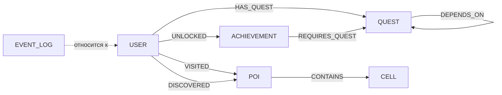

# GPS-квест — геолокационная quest/achievement-платформа

Учебный fullstack-проект курса **NoSQL** (СПбГЭТУ «ЛЭТИ»): геолокационная игра, в которой игрок выполняет квесты и открывает достижения, посещая реальные точки на карте, а администратор управляет контентом игры через отдельную админ-панель. Данные хранятся в графовой БД **Neo4j** — предметная область (игроки, квесты, достижения, точки интереса, их зависимости и события) сама по себе является графом, что и стало отправной точкой для выбора NoSQL-решения.

> Проект написан для учебного курса, но доведён до состояния рабочего прототипа: два независимых SPA, backend с ролевым доступом, ETL-сервис на Go и полный Docker Compose для локального запуска.

## Возможности

**Игрок**
- Интерактивная карта (Leaflet) с точками интереса поблизости
- Геопространственная фильтрация POI через H3-индексы
- Выполнение квестов, отслеживание прогресса и получение наград
- Открытие достижений с зависимостями от других квестов/достижений
- Профиль игрока: дистанция, опыт, статус

**Администратор**
- CRUD для квестов, точек интереса и достижений
- Редактор триггер-правил для квестов на основе JSON-схем
- Управление пользователями
- Просмотр журнала событий (лог всех действий в системе)
- Аналитический дашборд с графиками (Chart.js)
- Универсальный слой списков/фильтров (дерево фильтров, пагинация, сортировка) поверх Cypher-запросов, переиспользуемый для всех сущностей

## Стек

| Слой | Технологии |
|---|---|
| Frontend | Svelte 5 (rune-based реактивность), TypeScript, Vite, собственный лёгкий роутер, Leaflet, H3.js, Chart.js |
| Backend | TypeScript, Bun, Elysia, Neo4j (Cypher), `@neo4j/cypher-builder`, JWT-аутентификация |
| ETL | Go, парсинг OpenStreetMap PBF, загрузка точек интереса в граф |
| Инфраструктура | Docker Compose, Neo4j 5 (Community) |

## Архитектура данных

Ключевые узлы графа и связи между ними:



`CELL` — узел H3-ячейки; точки интереса привязываются к ячейке, что позволяет быстро находить POI поблизости от игрока без полного перебора координат. Уникальность и часть индексов заданы constraint'ами на `USER.id`, `USER.username`, `QUEST.id`, `POI.id`, `ACHIEVEMENT.id`, `CELL.index`, плюс индексы на `EVENT_LOG` по `user_id` и `timestamp` — под самый частый паттерн чтения (лента событий пользователя, отсортированная по времени).

## ETL: загрузка карты

Отдельный сервис на Go читает `.osm.pbf`-выгрузку OpenStreetMap, фильтрует и преобразует объекты в точки интереса и загружает их в Neo4j с привязкой к H3-ячейкам. Запускается как отдельный профиль Docker Compose с указанием пути к PBF-файлу.

## Быстрый старт

```bash
git clone <адрес-репозитория>
cd <папка-проекта>
docker compose up --build
```

По умолчанию:

| Сервис | Адрес |
|---|---|
| Backend (Elysia) | http://localhost:8081 |
| Neo4j Browser (dev-профиль) | http://localhost:7474 |
| Neo4j Bolt | localhost:7687 |

Все переменные окружения имеют дефолтные значения (см. `.env`), проект поднимается «из коробки» без дополнительной настройки.

Чтобы загрузить карту через ETL:

```bash
docker compose --profile etl up etl
```

### Тестовые пользователи

Для ревью и локальной проверки функциональности:

| Роль | Логин | Пароль |
|---|---|---|
| Admin | `admin` | `password` |
| Player | `player` | `password` |

## Структура репозитория

```
.
├── backend/          # Elysia + Bun API, модули по доменам (auth, quests, pois, achievements, admin/*, geo, leaderboard, profile)
├── frontend/          # Svelte 5 SPA: админ-панель + приложение игрока
├── etl/               # Go-сервис загрузки OSM PBF в Neo4j
├── internal/          # доменные модели и ETL-логика на Go
├── docker-compose.yml
└── docker-compose.dev.yml
```

## Происхождение проекта

Проект выполнен в рамках курса «NoSQL» и изначально размещался в организации университета; здесь — перенесённая копия с сохранением истории технических решений.